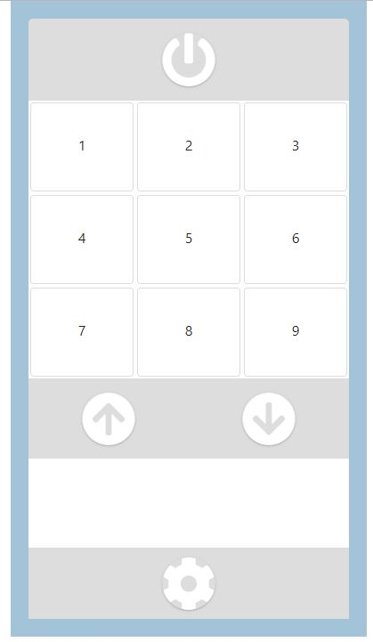

# remote-control-with-bootstrap

My projects:  A Remote Control using BootStrap 4

The project is built with HTML/CSS, Bootstrap and JQuery.
My mentor needed a simple remote control to watch italian tv online. 
He assigned me this task to practice and having fun at the same time.
The best thing to learn is applied what you are studing on real things.

I am building it in JQuery but once it will be finished I would like to rebuild it in vanilla JS or React.
This is the third version of this projects. You can find the others two by exploring my github page.

At the moment if you want to use it and test it, you have to download and install Xampp or similar.
Once Xampp has been installed, download the repo and unzip the folder into the xampp/hotdocs/test folder
Run Xampp apache server and target with your browser: localhost/test/remote control with bootstrap
click on the index.html page and then click on the engine button on the bottom, select Italy and click on the button  "load configuration"
Once the project will be finished it will be possibile to avoid xampp and upload an external api. 

